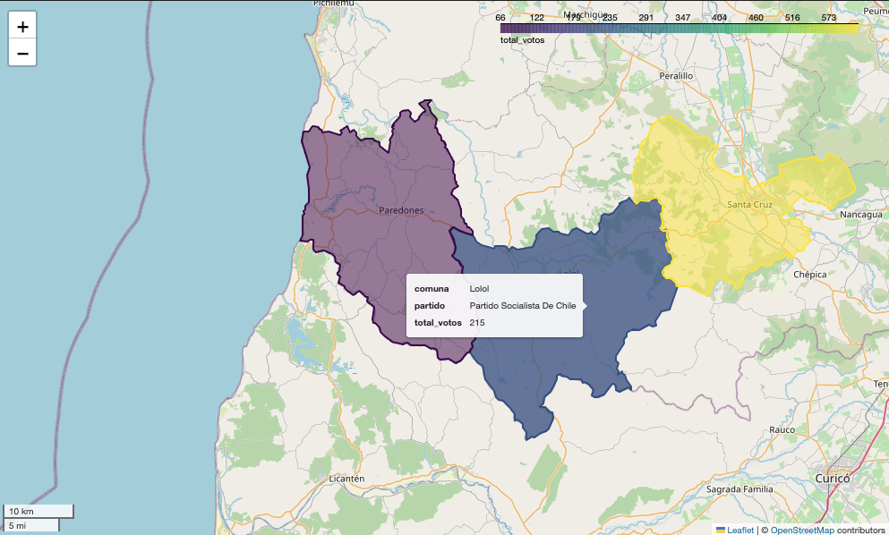

# prompt2map

prompt2map is a Python package that generates dynamic maps based on natural language prompts using Retrieval-Augmented Generation (RAG).

# Quickstart

Initialize the mapper with a PostGIS database
```python
from prompt2map import Prompt2Map

db_name = os.environ.get("DB_NAME")
db_user = os.environ.get("DB_USER")
db_password = os.environ.get("DB_PASSWORD")

p2m = Prompt2Map.from_postgis(db_name, db_user, db_password)
```

Make a query
```python
prompt = "Resultados del Partido Socialista en elección de diputados 2017, comunas de Paredones, Lolol, Santa Cruz"
my_map = p2m.to_map(prompt)
```

